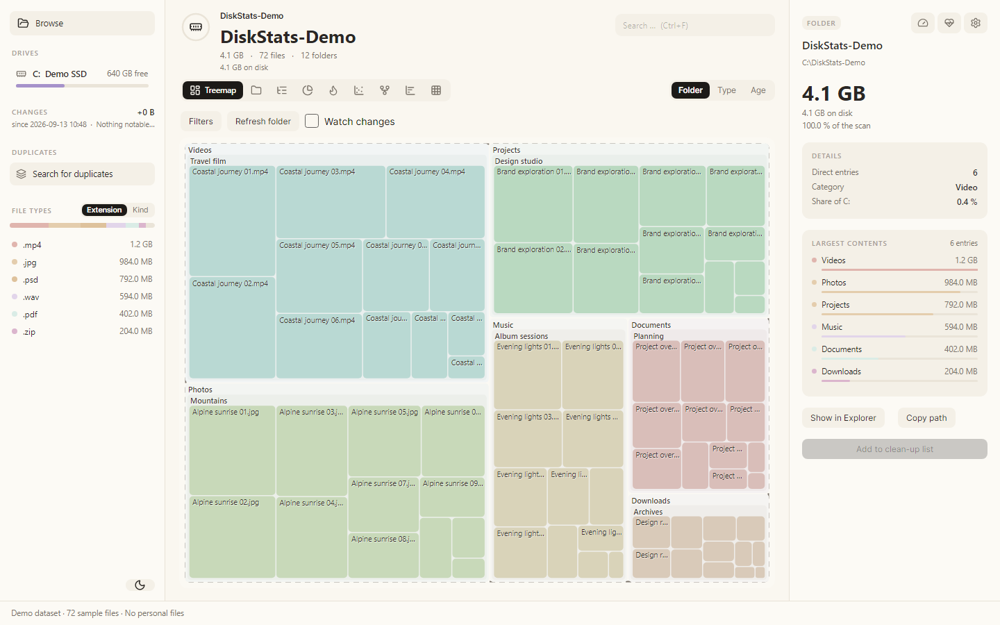
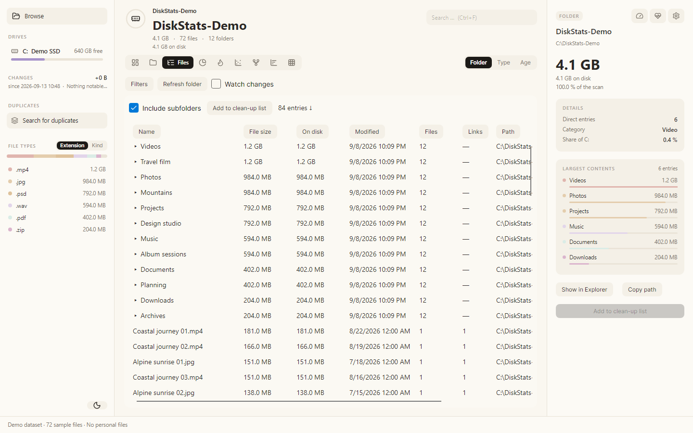
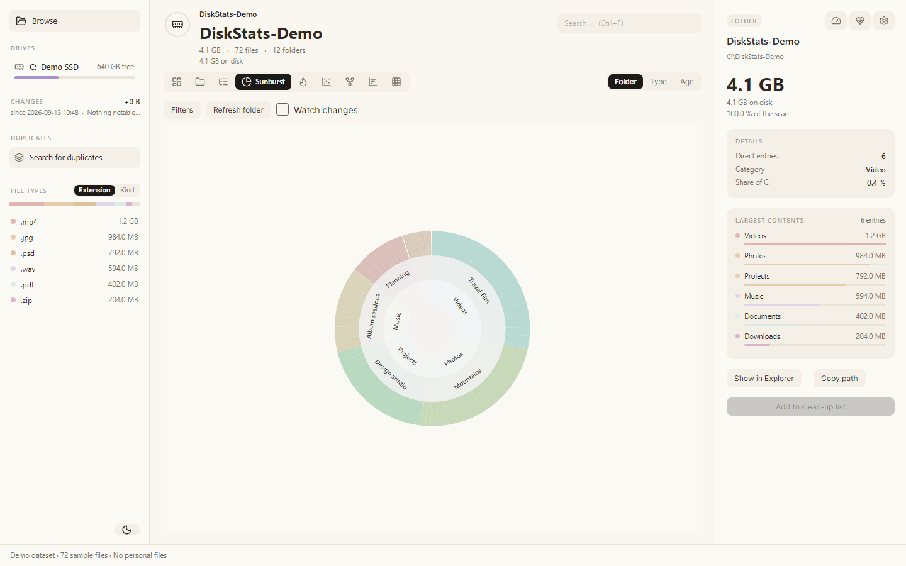
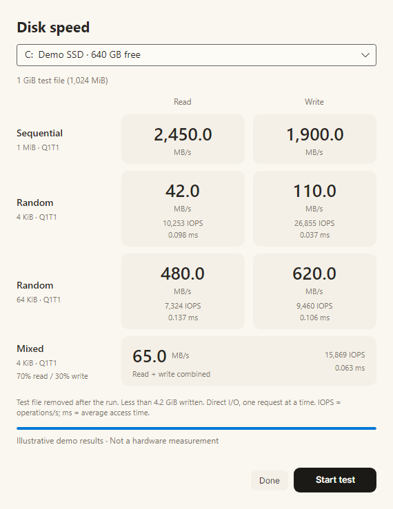
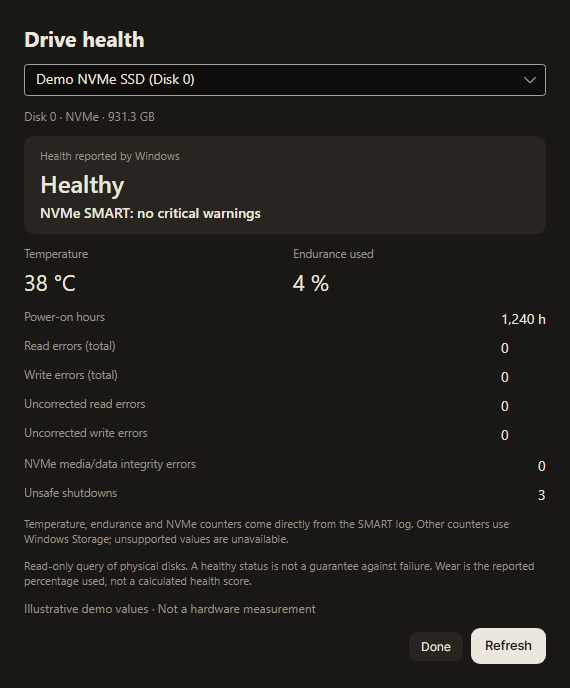
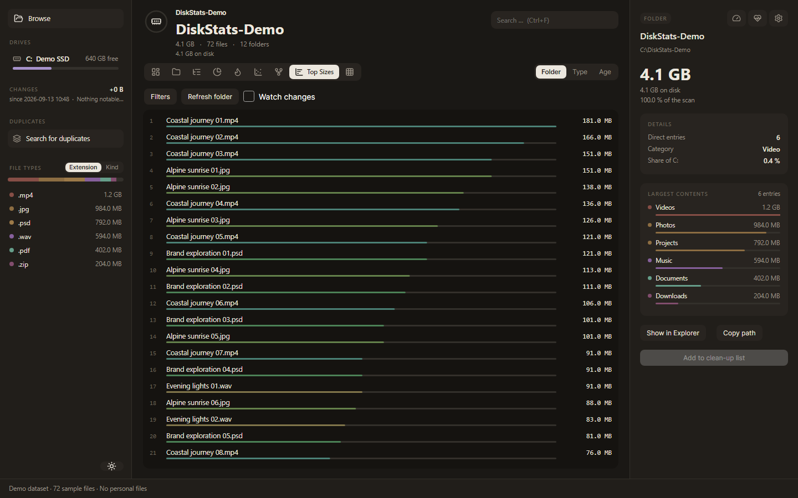

<div align="center">


# DiskStats

### See where your disk space goes.

Find large files, explore your storage, check drive health, and measure disk speed.
Built for Windows. Free and open source.

[](LICENSE)


[](https://github.com/krixoko/diskstats/actions/workflows/build.yml)

**[Get it free from the Microsoft Store](https://apps.microsoft.com/detail/9NP02X8BNMCT)**

[Features](#features) · [Screenshots](#screenshots) · [Build](#build-from-source) · [User guide](docs/usage.md) · [Contribute](CONTRIBUTING.md)

</div>



**Your files, at a glance.** Scan a drive or folder, explore the results, and review
what you want to remove before confirming any deletion.

## Features

| | What you can do |
|---|---|
| **Explore your storage** | Switch between nine views: Treemap, Folders, Files, Sunburst, Flame, Bubbles, Mind Map, Top Sizes, and Age Map. |
| **Find what matters** | Sort the complete file table, filter by name, size, or age, and exclude folders from scanning. |
| **Understand real disk usage** | Compare logical file size with allocated space, including compressed files, sparse files, and hardlinks. |
| **Spot changes and duplicates** | Compare scans, monitor folders, and find identical files with content-based duplicate detection. |
| **Check drive health** | Read Windows health status and supported SMART/NVMe values: temperature, endurance used, operating hours, and error counters. |
| **Measure disk speed** | Run sequential, random, and mixed read/write tests with a **1 GiB test file**, including throughput, IOPS, and average access time. |
| **Clean up with control** | Review a clean-up list, confirm deletions, open items in Explorer, and export results as CSV. |

English and German · Light and dark themes · Local scan processing · No app account required

## Screenshots

Screenshots are captured from the actual app. File listings use a synthetic demo
folder; drive capacity, health readings, and benchmark results are illustrative.
They contain no personal files and are not performance claims.

<table>
  <tr>
    <td width="50%"><strong>Find large files</strong><br />Sort files and folders by size and allocated space.</td>
    <td width="50%"><strong>Explore folder hierarchies</strong><br />Follow the sunburst rings into your storage.</td>
  </tr>
  <tr>
    <td></td>
    <td></td>
  </tr>
  <tr>
    <td><strong>Measure disk speed</strong><br />Sequential, random, and mixed I/O with a 1 GiB file.</td>
    <td><strong>Read drive health</strong><br />Windows status and supported SMART/NVMe metrics.</td>
  </tr>
  <tr>
    <td valign="top"></td>
    <td valign="top"></td>
  </tr>
</table>

<details>
<summary><strong>See the largest files in dark mode</strong></summary>



</details>

## Get started

1. Install DiskStats from the **[Microsoft Store](https://apps.microsoft.com/detail/9NP02X8BNMCT)**.
2. Choose a drive or folder with **Browse** and let the scan finish.
3. Explore the treemap or switch to **Files** to sort and filter the results.
4. Use the **speedometer** or **heart/pulse** button in the upper-right corner for
   disk speed and drive health.
5. To remove files, add them to the clean-up list and review it before confirming.

The Store app includes its .NET runtime. Regular scans do not need administrator
rights. Some storage metrics depend on the device, driver, adapter, and permissions;
unsupported health readings are shown as **Not available**.

The source includes the 1.1.0 features shown above. The corresponding Store update
was submitted for certification on September 13, 2026; Store rollout may lag behind
this repository. See the [1.1.0 release notes](docs/releases/1.1.0.md).

## How it treats your data

- **Local processing:** DiskStats does not send scan data to an application server.
  Cloud and network folders may transfer data through their own providers.
- **Explicit clean-up:** Nothing is deleted automatically. Windows may ask for
  additional confirmation when an item cannot be moved to the Recycle Bin.
- **Read-only health checks:** No disk writes, device self-tests, or automatic
  elevation. A healthy status cannot guarantee that a drive will not fail.
- **Bounded speed tests:** Each run creates its own 1 GiB file, writes less than
  4.2 GiB in total, and removes the test file on completion or cancellation.

Read the [user guide](docs/usage.md) for benchmark methodology, NTFS/MFT permissions,
allocation and hardlink behavior, shortcuts, and local data retention.

## Build from source

Install the **.NET 10 SDK** on Windows, then run:

```powershell
git clone https://github.com/krixoko/diskstats.git
cd diskstats
dotnet build -c Release
dotnet test -c Release --no-build
dotnet run --project src/DiskStats.App -c Release
```

<details>
<summary><strong>Create a Windows distribution or MSIX package</strong></summary>

Create a self-contained Windows x64 build:

```powershell
dotnet publish src/DiskStats.App -c Release -r win-x64 --self-contained true -o publish
```

MSIX packaging additionally requires the **Windows SDK**:

```powershell
.\packaging\build.ps1 -Store
```

The manifest contains the official RINGPAPERS Store identity. Independent Store
submissions need their own product identity and matching signing configuration.
App and manifest versions must match. See [Contributing](CONTRIBUTING.md) for details.

</details>

## Project structure

| Path | Contents |
|---|---|
| [`src/DiskStats.App`](src/DiskStats.App) | Avalonia interface, charts, dialogs, and localization |
| [`src/DiskStats.Core`](src/DiskStats.Core) | Scanning, analysis, clean-up, benchmarking, and drive health |
| [`src/DiskStats.Bench`](src/DiskStats.Bench) | Tools for local scan and memory measurements |
| [`tests`](tests) | Core and Avalonia Headless tests |
| [`packaging`](packaging) | MSIX build, Store manifest, icons, and dependency notices |
| [`docs`](docs) | User guide, architecture, screenshots, and release notes |

## Contribute

Bug reports, fixes, and improvements are welcome. Read the
[contribution guide](CONTRIBUTING.md) and [architecture overview](docs/architecture.md),
or [open an issue](https://github.com/krixoko/diskstats/issues).

For security reports, contact **kroxoko@gmail.com** privately. Remove personal
filenames, paths, and other private information from public logs and screenshots.

## License

DiskStats is licensed under the **[MIT License](LICENSE)**. You may use, modify,
and redistribute it, including commercially, while preserving the license and
copyright notices. This also applies to DiskStats' own code in the free Store app.

Third-party components retain their own licenses. Keep
[THIRD-PARTY-NOTICES.md](THIRD-PARTY-NOTICES.md) and the bundled
[`licenses`](packaging/licenses) directory with redistributed builds.
